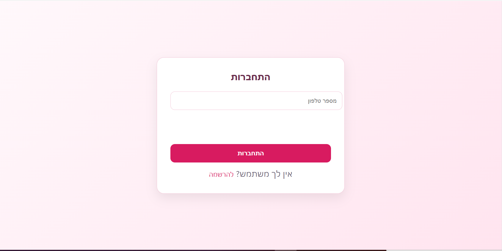
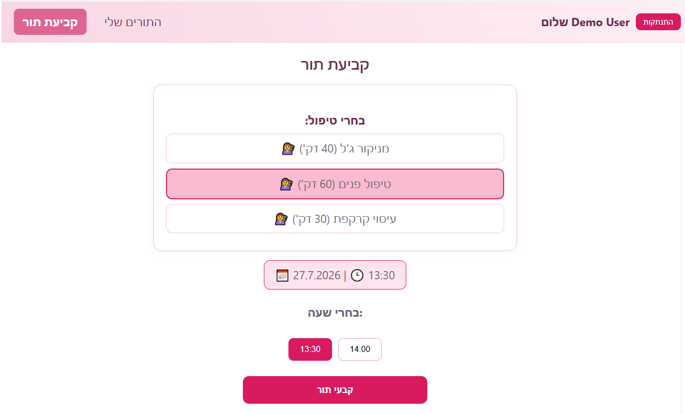
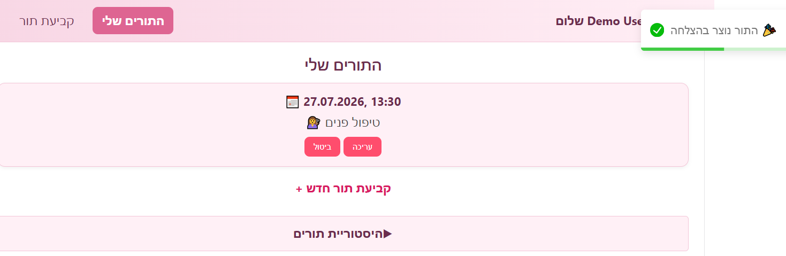
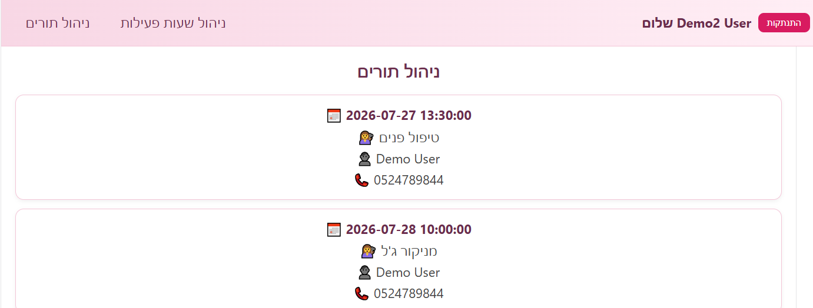

# Beauty Appointments - Frontend

Frontend application for managing beauty salon appointments.

The application allows customers to register, log in, view available appointments and manage their bookings.
An admin interface is available for managing business hours and appointments.

## Technologies

- React
- JavaScript
- HTML5
- CSS Modules
- Axios
- React Router
- React Toastify

## Features

### Customer
- User registration and login
- View available treatments
- Book appointments
- View appointment history
- Manage personal appointments

### Admin
- Manage business hours
- View and manage appointments

### Architecture
The application is built using a client-server architecture:
Frontend:
- React application
- Communicates with backend using REST API
Backend:
- Spring Boot REST API
- MySQL database

## Screenshots

### Login


### Booking Appointment


### Customer Appointments


### Admin Dashboard



## Running Locally

Clone the repository:

```bash
git clone https://github.com/TalSMT/beauty-appointments-frontend.git

## Install dependencies:
npm install

## Run the application:
```bash
npm run dev

## The application will run on:
http://localhost:5173

## Backend
This frontend communicates with a Spring Boot REST API backend
Backend repository:
https://github.com/TalSMT/beauty-appointments-backend

